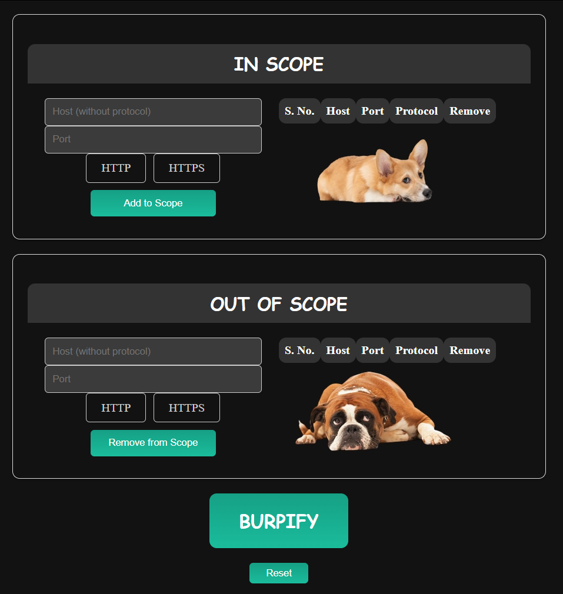
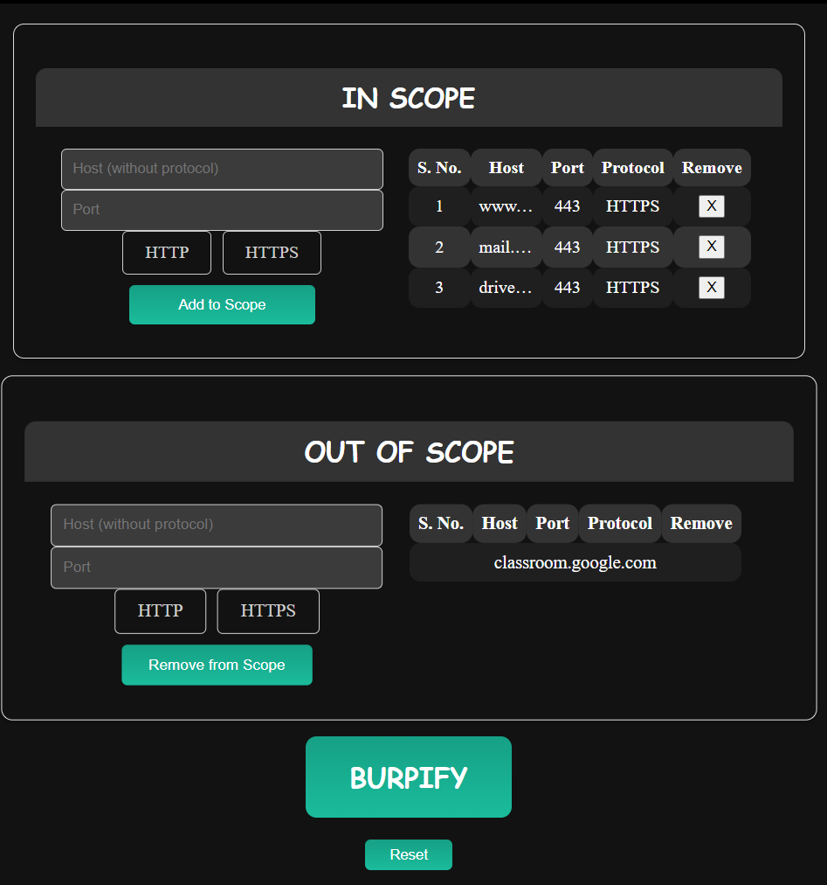

# Burpify

Burpify is an electron application that helps you easily create a configuration file for your Burp Suite Projects. For those who don't know what a configuration file is, this tool is probably not for you. Regardless, a configuration file helps you set In Scope and Out of Scope targets in your Burp Projects. This helps you increase your productivity by keeping all the unnecessary traffic out of your Burp Suite tabs.

## Reason of Existence

Burp's native config file generator is pretty much trash, and you need some good regex moves to get past it (which, by the way, still doesn't work). In most cases, I have found myself just avoiding using scopes and compromising with useless traffic in my Burp. Thus, the tool.

## Features

1. Add as many In Scope and Out of Scope targets as you like.
2. Have a quick look at the table for all the added targets.
3. Remove individual targets from the table.
4. Automatic check for duplicate targets.
5. Custom save location.
6. Easy-to-use design.

## Screenshots



(To view the complete hostname, just hover over it.)
## Output format

JSON file

## Building/Testing the app

```bash
sudo npm install -g electron
git clone https://github.com/Nidhish-11/burpify.git
cd burpify
npm install
npm start
```

## Installing the app

Head to the [Releases](https://github.com/Nidhish-11/burpify/releases/) to get an executable

## Usage

1. Add hostname and port number for the targets you want to be in scope.
2. Do the same for out-of-scope targets.
3. Click Burpify, and choose the location to save the file.
4. The JSON configuration file is generated.
5. Head to your Burp Suite, and load the configuration file.
6. The scope for your project has been set.

## Any Feedback is more than appreciated!

## License

This project is licensed under the MIT License - see the [LICENSE.md](./LICENSE) file for details.
